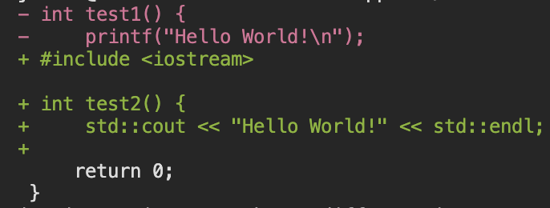

# Diff++

Diff++ is a C++ implementation of the Git diff algorithm. The first approach is a traditional Longest Common Subsequence (LCS) dynamic programming method O(N x M) while the second is based on the paper [An O(ND) Difference Algorithm and Its Variations](http://www.xmailserver.org/diff2.pdf) by Eugene Myers.

Git's diff algorithm does further enhance the Myers' algorithm, but exact replication is not the purpose of this project.

## Demo
